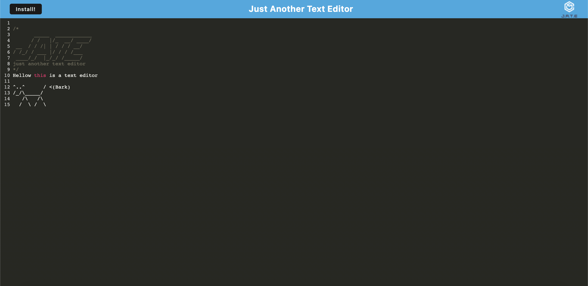

# M19-TextEditor
## Screenshot 📸

## About this project 🐊

This is a single page progressive web applicaton text editor. 

## Usage 🐗

To use this app download the files.
Run 'npm i' to install dependancies.
Run 'npm run start' to start the app.
Click on the install button to download the web app to your desktop.